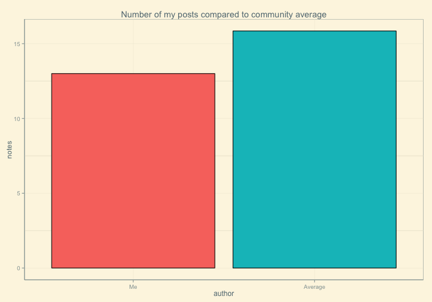
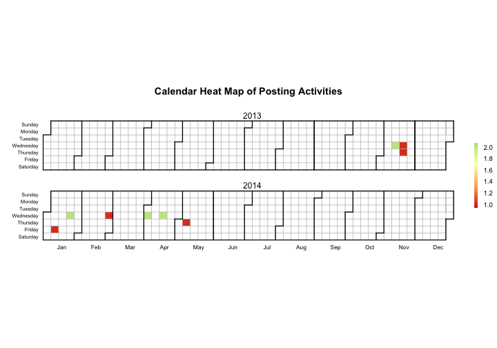
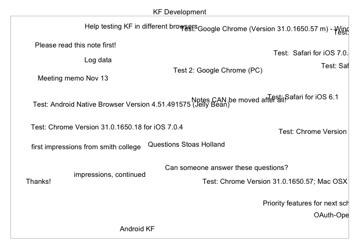

Minimal example of using KF APIs in R
========================================================


```r
source("lib/kf-api-lib.R")  # load the function library

library(ggplot2)
library(ggthemes)
library(tm)

## Login info
host = "http://kf.utoronto.ca:8080/kforum/"
username = "bodong"  # YOUR_USERNAME
password = "000000"  # YOUR_PASSWORD

## Create a curl handle that will be shared among API calls
curl = CreateCurlHandle()
```


## 1. User authentication


```r
## 1. User authentication
regs = Authenticate(host, username, password, curl)
regs[, c("sectionId", "sectionTitle")]  # check sections I'm in
```

```
##                              sectionId              sectionTitle
## 1 416658e6-b49f-4189-8f9a-fe78d8b5f4c1            KF Stress Test
## 2 b1f6fed2-a64e-4bd2-ab8b-393fb2ed1f06 Knowledge Society Network
```

```r

## Choose a section/community I'm interested in
userId = regs$authorInfo.guid[2]
sectionId = regs$sectionId[2]
```


## 2. My posts


```r
## 2. My posts
posts = GetSectionPosts(host, sectionId, curl)
myPosts = FilterPostsByAuthors(posts, userId)  # all my posts here
# str(myPosts[1, ])
```


### 2.1. Compare number of my posts with the community average


```r
# 2.1. Compare number of my posts with the community average
authors = do.call("rbind", posts$authors)  # all unique authors
tmp = data.frame(author = factor(c("Me", "Average"), levels = c("Me", "Average")), 
    notes = c(nrow(myPosts), nrow(posts)/length(unique(authors$guid))))
ggplot(data = tmp, aes(x = author, y = notes, fill = author)) + geom_bar(colour = "black", 
    stat = "identity") + ggtitle("Number of my posts compared to community average") + 
    guides(fill = FALSE) + theme_solarized()
```

 


### 2.2. My posting calendar


```r
# 2.2. My posting calendar
dates = strptime(myPosts$created, "%b %d, %Y %I:%M:%S %p")
dates_str = as.character(format(dates, format = "%Y-%m-%d"))
tmp = data.frame(table(dates_str))
names(tmp) = c("date", "value")
CalendarHeatmap(tmp, title = "Posting Activities")
```

 


# 2.3. My top terms


```r
# 2.3. My top terms
myNotes = Corpus(VectorSource(myPosts$body))
myDtm <- DocumentTermMatrix(myNotes, control = list(
  #   stemming = TRUE, 
  stopwords = TRUE, minWordLength = 3, 
  removeNumbers = TRUE, removePunctuation = TRUE))
myFreqTerms = findFreqTerms(myDtm, 8, 100)
myFreq = colSums(inspect(myDtm[, myFreqTerms]))
```


```r
tmp = sort(myFreq, decreasing = TRUE)
data.frame(term = names(tmp), freq = tmp, row.names = NULL)
```

```
##         term freq
## 1  knowledge   24
## 2   building   21
## 3       will   17
## 4  analytics   14
## 5       note   14
## 6       view   13
## 7     badges   11
## 8       open   10
## 9     design    8
## 10      need    8
```


## 3. Views in my community


```r
## 3. Views in my community
views = GetSectionViews(host, sectionId, curl)
# str(views[1, ])
views$title  # view titles
```

```
##  [1] "Ministry PD - LSA and TriBoard"                 
##  [2] "Sandbox"                                        
##  [3] "KF Bugs"                                        
##  [4] "Ideas for Global Networking"                    
##  [5] "KF Open Source License"                         
##  [6] "KF Open Source License"                         
##  [7] "PD Resources"                                   
##  [8] "KF Development Environment"                     
##  [9] "Knowledge Building Communities (KBC)"           
## [10] "Workshop: Knowledge Building Analytics"         
## [11] "KF Next Generation Designs"                     
## [12] "Developer's View"                               
## [13] "KF Development Management"                      
## [14] "Summer Institute 2014"                          
## [15] "KF Development"                                 
## [16] "Welcome"                                        
## [17] "Workshop Day 2"                                 
## [18] "liziyun"                                        
## [19] "KF logo designs"                                
## [20] "BCCI--Building Cultural Capacity for Innovation"
## [21] "Professional Development"                       
## [22] "Research Plans/Meetings 2013-2014"              
## [23] "Potential Drupal PD Website"                    
## [24] "BCCI--Building Cultural Capacity for Innovation"
## [25] "KF Manual"
```


## 4. Inspect one view


```r
## 4. Inspect one view
viewId = views[15, "guid"]  # I'm interested in view #15
view = GetView(host, viewId, curl)
```


### 4.1. Number of posts in the view


```r
# 4.1. Number of posts in the view
nrow(view$viewPostRefs)
```

```
## [1] 23
```


### 4.2. Percentage of build-ons posts


```r
paste0(round(100 * nrow(view$buildOns)/nrow(view$viewPostRefs), 2), "%")
```

```
## [1] "21.74%"
```


### 4.2. Revisualize the view


```r
# 4.2. Revisualize the view
ggplot(view$viewPostRefs, aes(x = location$point$x, y = location$point$y)) + 
    geom_text(aes(label = postInfo$title), hjust = 0) + ggtitle(view$title) + 
    scale_y_reverse() + theme_bw() + theme(axis.title = element_blank(), axis.text = element_blank(), 
    axis.ticks = element_blank(), panel.grid = element_blank())
```

 


### 4.3. Top terms in the view


```r
# 4.3. Top terms in the view
notes = Corpus(VectorSource(view$viewPostRefs$postInfo$body))
dtm <- DocumentTermMatrix(notes, control = list(stopwords = TRUE, minWordLength = 3, 
    removeNumbers = TRUE, removePunctuation = TRUE))
freqTerms = findFreqTerms(dtm, 8, 100)
freq = colSums(inspect(dtm[, freqTerms]))
```


```r
tmp = sort(freq, decreasing = TRUE)
data.frame(term = names(tmp), freq = tmp, row.names = NULL)
```

```
##         term freq
## 1       note   45
## 2       view   33
## 3      notes   22
## 4        can   17
## 5        new   13
## 6       will   13
## 7        tap   12
## 8       work   12
## 9        add   10
## 10    chrome   10
## 11    issues   10
## 12   version   10
## 13     ideas    9
## 14       one    9
## 15     views    9
## 16  attached    8
## 17     build    8
## 18    design    8
## 19      idea    8
## 20       ios    8
## 21      need    8
## 22 scaffolds    8
## 23      text    8
## 24     title    8
## 25       use    8
```

```r

# overlap between my freq terms and shared freq terms
intersect(myFreqTerms, freqTerms)
```

```
## [1] "design" "need"   "note"   "view"   "will"
```


